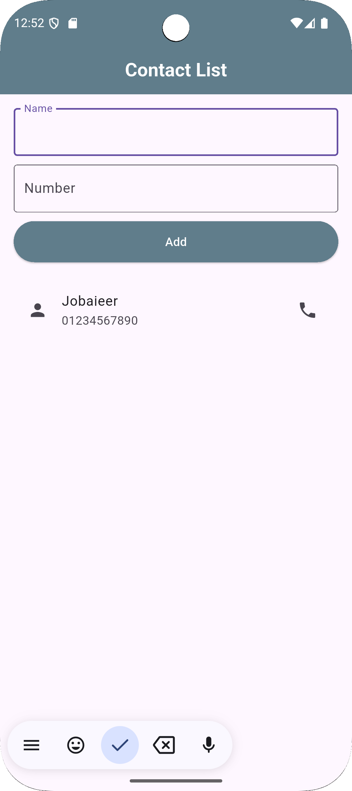
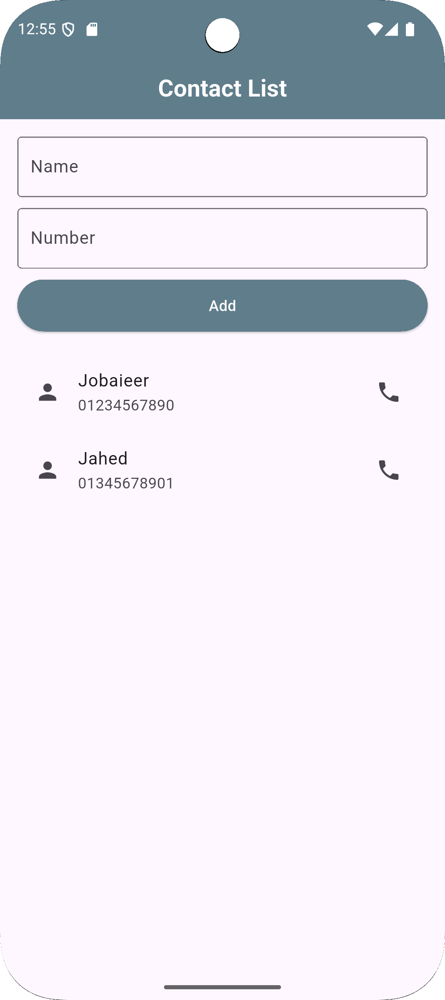
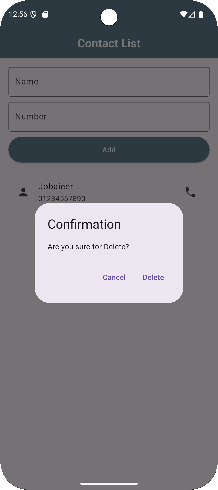

# 📱 Flutter Contact List App

This is a simple Contact List application built with Flutter. It allows users to:

- Add a contact (name and number)
- View all added contacts in a list
- Delete a contact with a confirmation dialog (long press to delete)

## 🚀 Features

- 📇 Add new contacts with name and phone number
- 📜 Display all contacts in a scrollable list
- 🗑 Long-press on a contact to confirm and delete
- 🧼 Clean UI and responsive layout

## 🛠 Technologies Used

- Flutter (SDK)
- Dart (Language)
- Material Design components

## 📸 Screenshots

| Add Contact                           | Contact List | Delete Confirmation |
|---------------------------------------|---------------|---------------------|
|  |  |  |


## 📂 Project Structure

```
flutter-contact-list/
├── lib/
    └── main.dart #Main app logic and UI
├── screens/
│   ├── add_screen.png
│   ├── list_screen.png
│   └── delete_dialog.png
├── README.md
```

## 🔗 Connected with @jobaieer

[](https://jobaieer.netlify.app)
[](https://facebook.com/jobaieerofficial)
[](https://www.linkedin.com/in/jobaieer)

